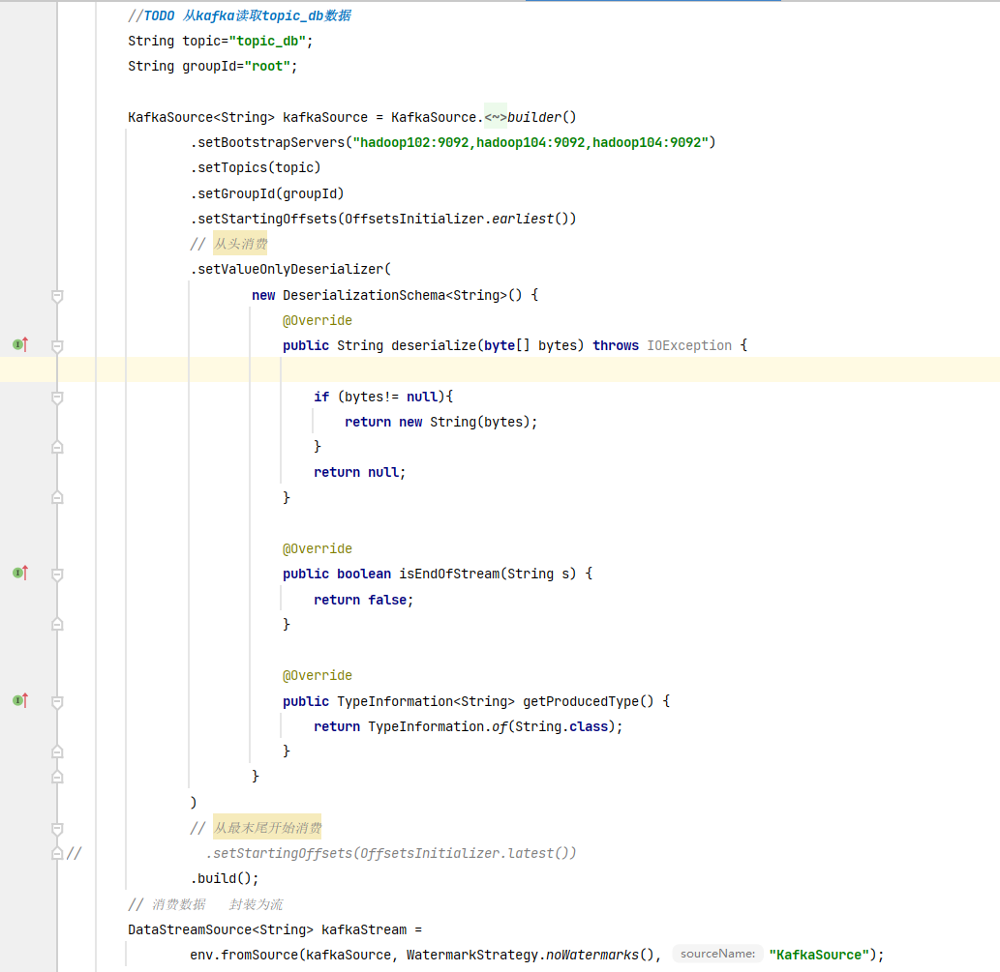
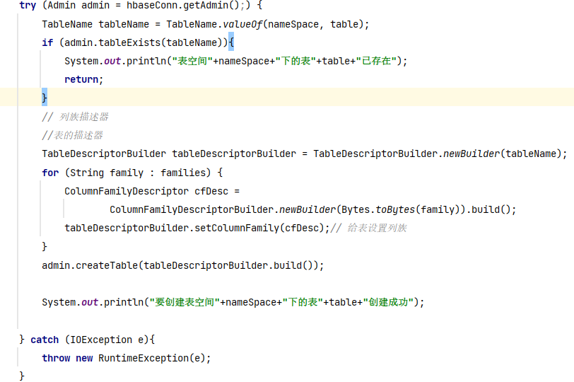

# 12.10

1. 创建Maven的Flink实时项目,父工程和子模块的关系,解决pom文件的报错,依赖无法下载,在Maven目录的conf里修改settings.xml文件,私库无法下载连接外网下载.
生产数据业务数据到kakfa的topic_db里日志生产到kakfa的topic_log1里面,使用Flink实时消息数据,确保数据成功
测试Flink可以读取kafka数据,实时消费,

# 12.11

1. DIM层设计要点,实时消费topic_db和topic_log1的数据,建立维度建模,使用cdc读取配置表,封装为对象,把配置表的数据在hbase里面建表,然后实现广播流把topic_db的数据保存到hbase里,需要编写hbase工具类确保hbase列族建表完成和不会重复在hbase里面重复基本报错,
实现hbase没有列族无法添加数据

# 12.12

1. 数据倾斜问题 : 现在华东和西北有1亿条数据量,华东数据量为8千万,西北数据量为8百万,可以看出发生了严重的数据倾斜.在hive里数据倾斜在业务数据方面,不同数据类型关联产生数据倾斜等
   解决数据倾斜优化的一种方法
   with t1 as (
   select user_id,
   order_no,
   concat(region,'-',rand()) as  region,
   product_no,
   color_no,
   sale_amount,
   ts
   from data_incline_t
   )
   select substr(region,1,2) as region,
   count(*) as cnt
   from (
   select region,
   count(*) as cnt
   from t1
   group by region
   ) as t2
   group by substr(region,1,2);
2. 可以在地区字段后面拼接一个随机数这个随机数要不可重复,把数据分散开,因为我们拼接了一个随机数,可以使用子查询分组查询个数,然后把截取地区出来,然后进行聚合分组查询可以减少运行时间
3. 我们可以增加map的数量 设置Map任务数量 SET mapreduce.job.maps=10  设置Reduce任务数量 SET mapreduce.job.reduces=5;

# 12.13

1. 广播流 分流业务 ()  写入hbase做维度关联 变更数据 获取状态  对读取的配置表数据进行 类型转换  jsonStr->实体类  根据当前配置表到Hbase里执行建表和删除操作 对配置流数据进行广播--connect  对关联数据进行处理--process 
2. 广播流数据为什么保存到hbase(后续关联数据进行处理)    使用invoke方法保存到hbase  
3. 项目提取方法  alt+shift+m 数据清洗（ETL）  新老访客状态标记修复  分流：利用侧输出流实现数据拆分  启动日志,页面日志,曝光日志,动作日志,错误日志

# 12.14

1. Flink CDC，是利用 Apache Flink 流处理框架实现的一种实时数据同步技术。它能够实时捕获并同步源数据库的增量变动，将变动数据实时传输到目标系统，从而实现数据同步和数据集成。
2. FlinkCDC 底层实现主要依赖于Debezium这个开源的分布式同步和捕获数据变化的引擎。Debezium能够捕获数据库的变更数据并转换为统一的格式，然后FlinkCDC进一步处理这些数据，实现数据的实时处理\
3. 从 Kafka 页面浏览明细主题读取数据，过滤搜索行为，使用自定义 UDTF（一进多出）函数对搜索内容分词。统计各窗口各关键词出现频次，写入 Doris

# 12.16

1. 关联订单明细表、订单表、订单明细活动关联表、订单明细优惠券关联表四张事实业务表的insert操作，形成下单明细表，写入 Kafka 对应主题
2. 从 Kafka 读取topic_db主题数据，关联筛选订单明细表、取消订单数据、订单明细活动关联表、订单明细优惠券关联表四张事实业务表形成取消订单明细表，写入 Kafka 对应主题
3. 从 Kafka topic_db主题筛选支付成功数据、从dwd_trade_order_detail主题中读取订单事实数据、LookUp字典表，关联三张表形成支付成功宽表，写入 Kafka 支付成功主题

# 12.17
1. 使用Flink的Application提交jar包到yarn上面运行,实时获取端口号nc -lk 的数据
2. 
