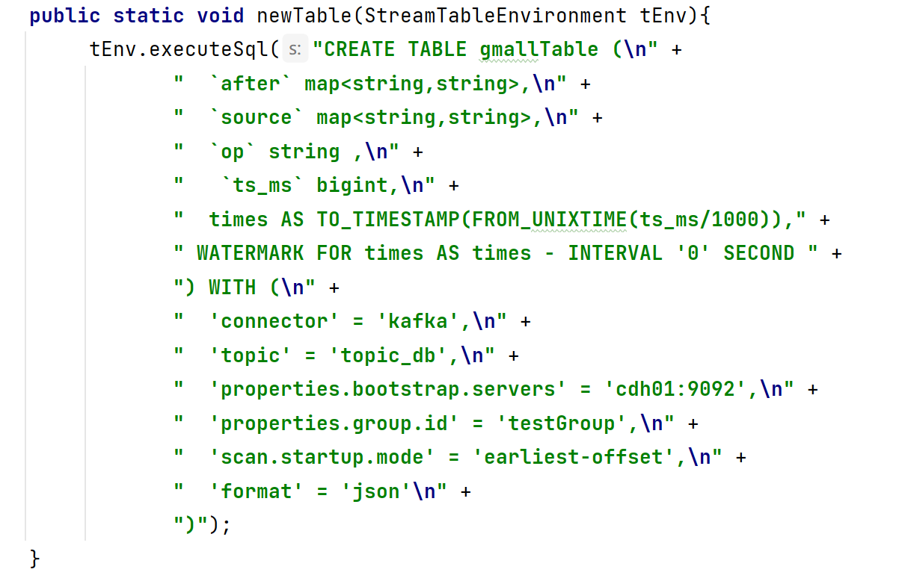
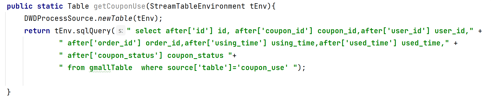

根据原始代码进行优化处理 dwd层的原始数据读取解析 根据保存到hbase压缩格式为snappy的数据根据表名获得列族info获得需要的数据  为了dws的业务做准备
还有一些数据还是在kafka里 数据格式是json的所以我们需要使用FlinkSQL读取kafka里我们需要使用到的表

这个是所有的表 我们可以通过我们需要的表字段需求进行深入的读取

进行拉宽变的处理  拉宽表可以将不同流中的相关数据合并，方便在流处理过程中进行复杂的计算和规则匹配,也便于更好地管理和更新状态