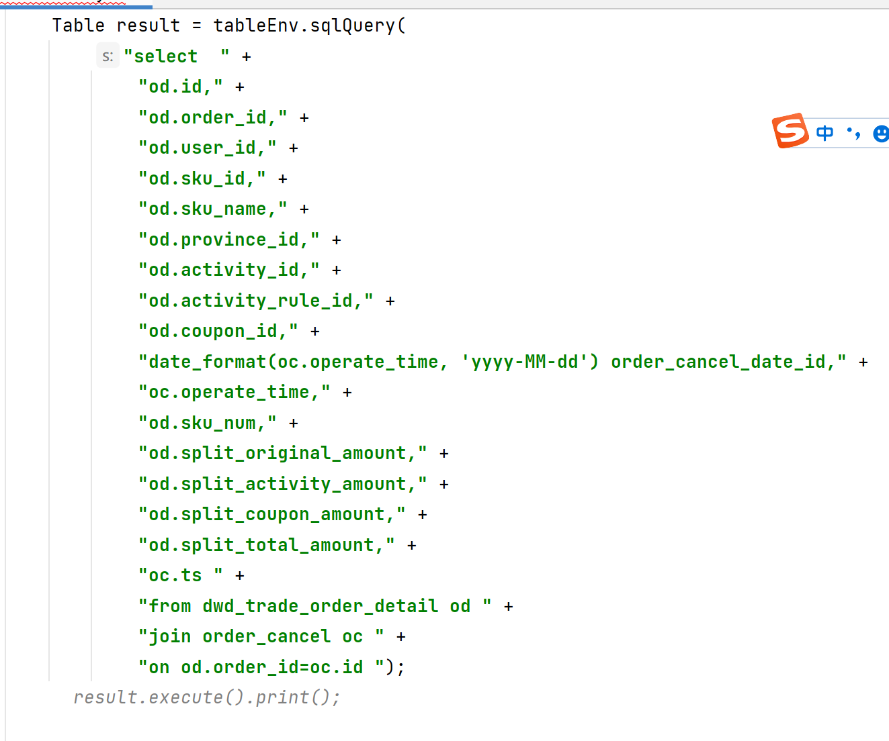
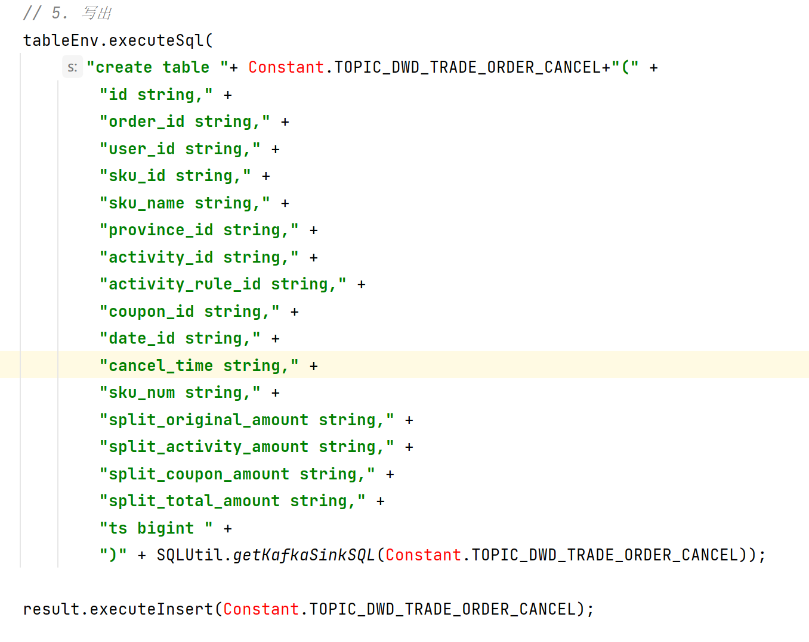

对dwd仓的宽表 也是保存到kafka里 为什么下一步业务方便读取处理 FlinkSQL处理后的数据需要输出到kafka时，拉宽表可以将需要输出的数据整合到一个结构中。这样可以更方便地将数据按照外部系统要求的格式进行输出,可以直接使用完整的数据,也减少数据冗余和提高数据一致性
 
然后在在Dws层使用拉宽表可以更好地利用存储和查询优化技术,也才用压缩格式(比如snappy压缩格式)来提高数据的存储和查询效率.拉宽表也便于进行数据分区和索引构建,进一步优化数据的存储和查询性能,使得可以从多个角度进行数据分析
